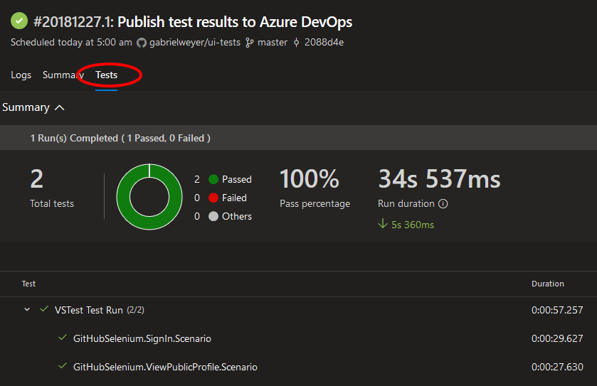

# UI testing

I want to learn how to write UI tests. [Selenium WebDriver][selenium-webdriver] seems to be the most commonly used platform. I also stumbled upon [Puppeteer][puppeteer] and decided to use both libraries.

I decided to test [Goodreads][github] as this is one of the few sites I use that does not require Multi-Factor Authentication.

Over time I hope to see my tests' brittleness exposed which will give me the opportunity to make them more resilient. This example is a bit contrived as teams commonly use data attributes to ease `UI` testing.

As this project is a learning experience I wouldn't recommend being inspired by it (this is even more true for the `Puppeteer` / `TypeScript` tests where I've no idea what I'm doing :joy_cat:).

- [Selenium C# implementation README](./selenium-csharp/README.md)
- [Puppeteer implementation README](./puppeteer/README.md)

## Configuration

Some tests require a `Goodreads` account to run.

The configuration of secrets is explained in the [Selenium C#](./selenium-csharp/README.md) and [Puppeteer](./puppeteer/README.md) `READMEs`.

## Tests

- Load a user profile and assert the full name
- Sign-in with a test user and assert that the "My Books" header link is present

## Continuous Integration

I'm using [Azure pipelines][azure-pipelines] to run the tests on every commit to `main`.

The builds steps are versioned with the code as `YAML`:

- [selenium-csharp.yml](./selenium-csharp.yml)
- [puppeteer.yml](./puppeteer.yml)

All builds are also scheduled to run at 5:00 AM Australia/Melbourne seven days a week. This is to prevent the tests from rotting when no changes are committed to them.

### Common build properties

- Builds are only triggered when the code changes. The `Puppeteer` build will not trigger when there are changes to the `Selenium C#` tests
- When a test fail, the test suite takes a screenshot which is then uploaded as an artifact
- Test results are uploaded to `Azure DevOps` (see screenshot below)
- Secret variables are passed as environment variables

Test results in `Azure DevOps`:

[selenium-webdriver]: https://www.seleniumhq.org/projects/webdriver/
[puppeteer]: https://developers.google.com/web/tools/puppeteer/
[github]: https://github.com/
[goodreads]: https://www.goodreads.com/
[azure-pipelines]: https://azure.microsoft.com/en-au/services/devops/pipelines/
